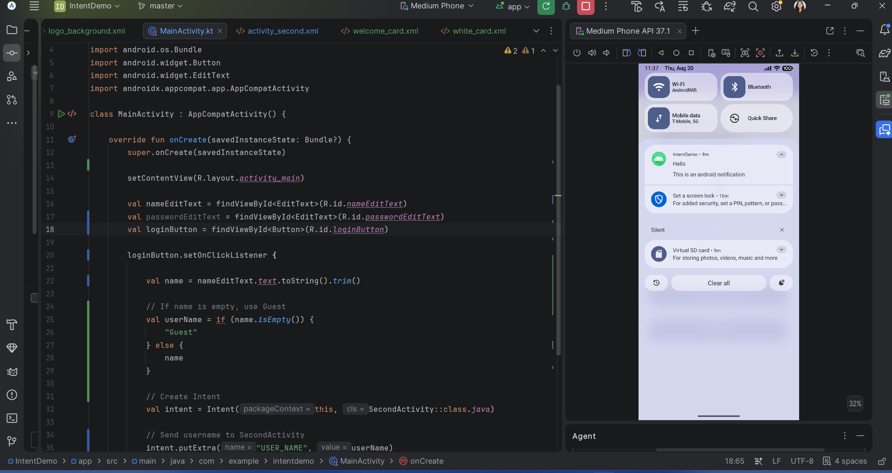
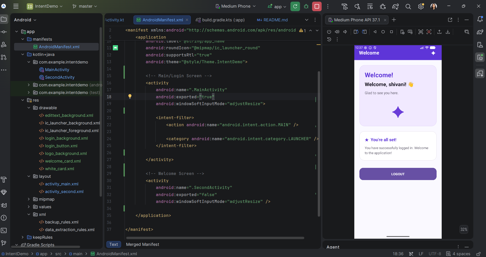

# Intent Demo - Premium Login & Notification Experience

A beautifully designed Android application that showcases a professional **Login Flow**, **System Notifications**, and the core concept of **Intents** for navigation and data passing.

## ✨ Features

*   **Premium UI Design:** A modern, aesthetic interface featuring custom gradients, soft shadows, and rounded corners.
*   **System Notifications (Expt 5):** Demonstrates the Android Notification API with custom channels and permission handling for Android 13+.
*   **Dynamic Greetings:** Personalized welcome messages that adapt based on user input.
*   **Custom Theming:** A cohesive Purple & Lavender design language implemented via custom XML drawables.
*   **Intelligent Logic:** Handles empty inputs by defaulting to a "Guest" session.
*   **Responsive Layout:** Uses `ScrollView` to ensure the interface looks great on all screen sizes.

## 🛠️ Built With

*   **Kotlin** - Modern, concise, and safe programming.
*   **Material Design 3** - Following the latest Android design standards.
*   **Custom XML Drawables** - For high-performance gradients and specialized shapes.
*   **Explicit Intents** - Navigation and data transfer between activities.
*   **NotificationManager** - System-level alerts and communication.

## 📐 Design Components

This project uses several custom-designed assets:
*   `login_background`: A smooth 135-degree gradient from White to Light Lavender.
*   `login_button`: A vibrant Purple gradient with soft rounded corners.
*   `edittext_background`: Clean, white input fields with subtle lavender strokes.
*   `welcome_card`: A specialized container for a premium user onboarding feel.

## 🚦 Getting Started

1.  **Clone the repository:**
    ```bash
    git clone https://github.com/yourusername/IntentDemo.git
    ```
2.  **Open in Android Studio:**
    Open the root folder of the project.
3.  **Run the app:**
    Select an emulator or physical device and click the **Run** button.

## 📖 How it Works

### 1. Intent Navigation
Capturing and passing user data from `MainActivity`:
```kotlin
val intent = Intent(this, SecondActivity::class.java)
intent.putExtra("USER_NAME", userName)
startActivity(intent)
```

### 2. System Notifications (Experiment 5)
Triggering a notification with high compatibility:
```kotlin
val builder = NotificationCompat.Builder(this, channelId)
    .setSmallIcon(R.drawable.ic_launcher_foreground)
    .setContentTitle("Hello")
    .setContentText("This is an android notification")
    .setPriority(NotificationCompat.PRIORITY_DEFAULT)
    .setAutoCancel(true)

NotificationManagerCompat.from(this).notify(notificationId, builder.build())
```


## 📸 Screenshot





## 📄 License

This project is open-source and available under the [MIT License](LICENSE).
